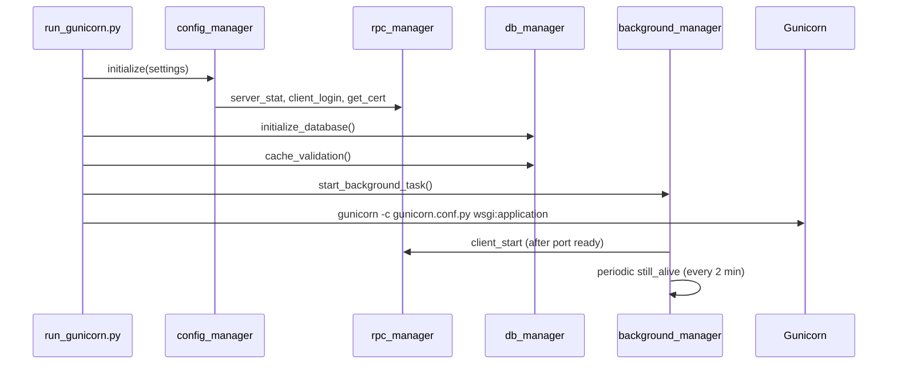
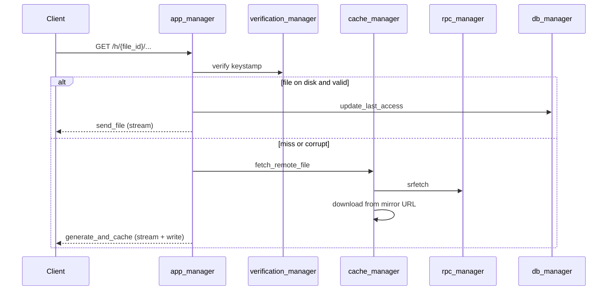
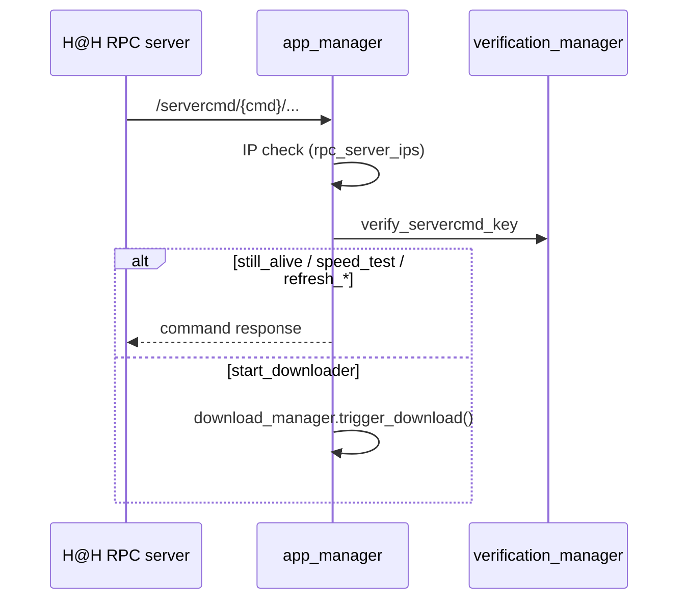

# Architecture

## Startup sequence

## Cache miss (`GET /h/...`)

## Server command dispatch

## Shutdown

1. `SIGINT` / `SIGTERM` → `background_manager.notify_client_stop()`
2. RPC `client_stop` sent if startup completed
3. `config/config.json` removed; DB connections closed
4. Gunicorn workers exit

## Configuration flow

- **Main process**: `config_manager.initialize()` fetches live config from RPC and writes `config/config.json`
- **Gunicorn workers**: `create_app()` loads cached JSON via `load_from_config_file()`
- **Paths**: `settings.py` → `initialize()` → `Config.*` → `hath.paths` helpers

## Gunicorn reload (cert refresh)

`refresh_cert` servercmd downloads a new PKCS#12 bundle, then sends `SIGUSR2` to the Gunicorn master (see `event_manager.restart_gunicorn()`). Workers reload with the updated certificate files on disk.
